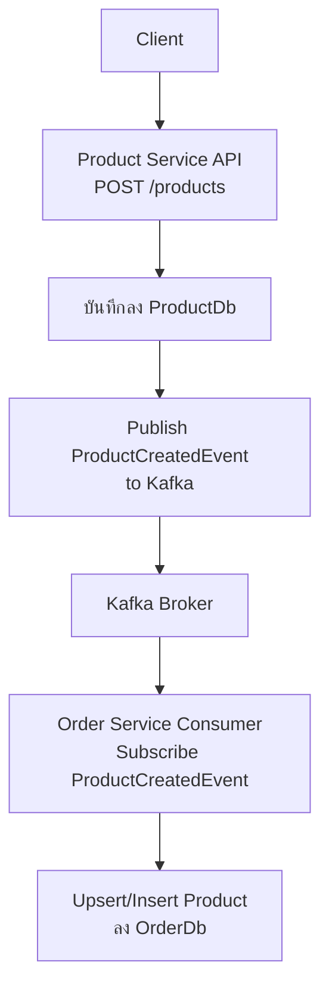
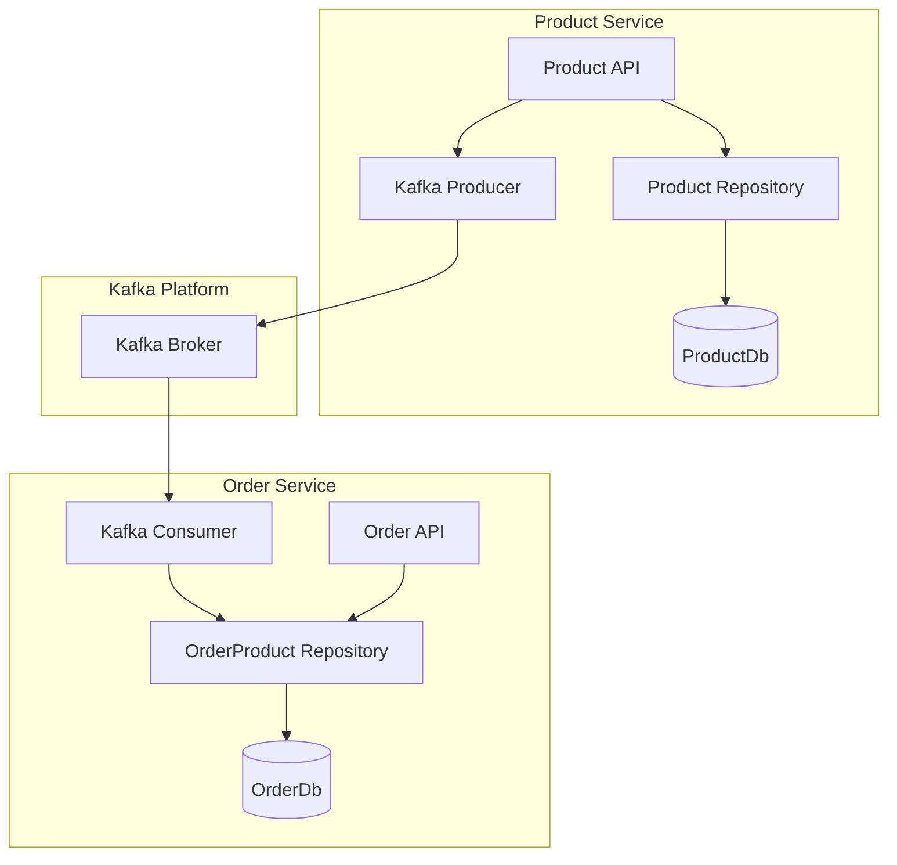

# Simple Microservices: Product Service & Order Service (Communication via Kafka)

**ตัวอย่างระบบไมโครเซอร์วิส (Microservices Example):**

* **Product Service** และ **Order Service**
* แต่ละ Service มีฐานข้อมูลแยกของตัวเอง (ProductDb, OrderDb)
* การสื่อสารระหว่าง Service ใช้ **Kafka** (Asynchronous Messaging)
* ไม่มีการเรียก API ตรง (No Synchronous API Call)

#

### เป้าหมาย (Objective)

* เมื่อมีการเพิ่มสินค้าใหม่ลงใน **ProductDb** ที่ Product Service
* Product Service จะส่ง Event (New Product) ไปที่ **Kafka Broker**
* Order Service จะเป็น Consumer คอยดึง Event จาก Kafka และนำข้อมูลสินค้าใหม่ไปบันทึกลง **OrderDb** ของตัวเอง
* ระบบนี้แยก Product Service และ Order Service คนละโปรเจกต์ คนละรีโพ คนละ Solution อย่างชัดเจน

#

### Communication Flow

```
[Product Service] (ProductDb)
      │  เพิ่มสินค้าใหม่
      ▼
ส่ง Event "New Product"
      │
      ▼
   [Kafka Broker]
      │
      ▼
[Order Service] (OrderDb)
 รับ Event, Insert ข้อมูลสินค้าใหม่
```

#

### จุดเด่น

* **Loose Coupling:** Services แยกจากกันอย่างสิ้นเชิง
* **Scalability:** ขยายแยกอิสระตาม Load ของแต่ละ Service
* **Reliability:** หาก Order Service Down ก็สามารถรับ Event ย้อนหลังได้เมื่อกลับมาทำงาน
* **Asynchronous Communication:** ลดปัญหาคอขวดและ Dependency

---

### 

> ตัวอย่างนี้สาธิตการสื่อสารข้อมูลข้าม Service ด้วย Kafka โดยไม่มีการเรียก REST API ตรงระหว่าง Product Service และ Order Service
> ทุก Service มีฐานข้อมูลของตัวเอง และรับ-ส่งข้อมูลผ่าน Event-Driven Architecture เท่านั้น


---
 

 
# **Activity Diagram, Component Diagram**
 

## 1. **Activity Diagram**

**Create Product → Sync ไป Order Service ผ่าน Kafka**



**อธิบาย:**

* Client เรียก Product API
* Product Service บันทึก DB ของตัวเอง แล้ว Publish Event ไป Kafka
* Order Service Consume Event แล้วบันทึก/Sync Product ลง DB ของตัวเอง

---

## 2. **Component Diagram**



**อธิบาย:**

* Product API เรียกใช้ Repository (ติดต่อฐานข้อมูล) และ Kafka Producer
* Kafka Broker รับ Event
* Order Service มี Consumer ที่รับ Event แล้วเขียนข้อมูลลง OrderDb
* Order API อ่าน/แก้ไขข้อมูลผ่าน Repository

---

## 3. **อธิบายโครงสร้างโปรเจกต์/ไฟล์และ Layer**

### **Product Service**

* **Controllers/ProductController.cs**
  รับ HTTP Request (POST, GET ฯลฯ)
* **Application/Services/ProductService.cs**
  Business Logic จัดการสินค้า
* **Infrastructure/Repositories/ProductRepository.cs**
  เชื่อมฐานข้อมูล
* **Infrastructure/Kafka/KafkaProducer.cs**
  สร้างและส่ง Event ไป Kafka (Publish)
* **Domain/Entities/Product.cs**
  โมเดลข้อมูลสินค้า
* **Domain/Events/ProductCreatedEvent.cs**
  โมเดลสำหรับ Event ที่ส่งไป Kafka

### **Order Service**

* **Infrastructure/Kafka/KafkaProductConsumer.cs**
  Consumer ที่รอรับ Event จาก Kafka (BackgroundService)
* **Application/Services/OrderProductService.cs**
  Logic สำหรับ Sync/Upsert ข้อมูล Product
* **Infrastructure/Repositories/OrderProductRepository.cs**
  เขียน/อ่านฐานข้อมูล OrderDb
* **Domain/Entities/Product.cs**
  โมเดล Product ที่เก็บใน OrderDb

---

## **คำอธิบายชั้น/Layer**

* **API/Controller Layer:** รับ-ตอบ HTTP Request (RESTful)
* **Application/Service Layer:** จัดการ Business Logic
* **Infrastructure Layer:** จัดการ DB (Repository), สื่อสารกับ Kafka (Producer/Consumer)
* **Domain Layer:** ข้อมูล/Entity/DTO ที่ใช้ข้ามระบบ

#

# Overview

## 1. **Concept Overview**

* **Product Service:**
  ดูแลการ CRUD สินค้า เก็บข้อมูลในฐานข้อมูลตัวเอง
  เมื่อมีการ `Create/Update` สินค้า → ส่ง Event ไป Kafka (Topic: `product-created`)

* **Order Service:**
  มีฐานข้อมูลของตัวเอง
  Subscribe Kafka (Topic: `product-created`) เพื่อ Sync ข้อมูลสินค้าใหม่/อัปเดตเข้า Order DB
  (กรณีนี้: ไม่ดึงตรงจาก Product API, sync ด้วย Event เท่านั้น)

#

## 2. **แยก Project / Repo / Solution**

* **แต่ละ Service:**

  * คนละ Solution (.sln)
  * คนละ Git Repo
  * Build, Deploy แยกอิสระ
* **Kafka**: ใช้ broker กลาง (เช่น docker compose)

#

## 3. **Product Service (Publisher)**

### 3.1 **Database Schema**

```sql
CREATE TABLE Products (
    Id INT IDENTITY(1,1) PRIMARY KEY,
    Name NVARCHAR(100) NOT NULL,
    Description NVARCHAR(255),
    Price DECIMAL(18,2),
    Stock INT,
    CreatedAt DATETIME DEFAULT GETDATE(),
    UpdatedAt DATETIME DEFAULT GETDATE()
);
```

#

### 3.2 **Entity**

```csharp
public record Product(
    int Id,
    string Name,
    string Description,
    decimal Price,
    int Stock,
    DateTime CreatedAt,
    DateTime UpdatedAt
);
```

#

### 3.3 **Event Contract**

> **แนะนำ:** แยก Project/Repo `Shared.Contracts` สำหรับ Event ที่ทั้ง 2 ฝั่งใช้ร่วมกัน
> แต่ถ้าเริ่มต้น ให้ copy โค้ดเหมือนกันทั้งสอง service

```csharp
public record ProductCreatedEvent(
    int Id,
    string Name,
    string Description,
    decimal Price,
    int Stock,
    DateTime CreatedAt,
    DateTime UpdatedAt
);
```

#

### 3.4 **Kafka Producer**

```csharp
using Confluent.Kafka;
using System.Text.Json;

public class KafkaProducer
{
    private readonly string _broker;
    private readonly string _topic;

    public KafkaProducer(string broker, string topic)
    {
        _broker = broker;
        _topic = topic;
    }

    public async Task PublishProductCreatedAsync(ProductCreatedEvent product)
    {
        var config = new ProducerConfig { BootstrapServers = _broker };
        using var producer = new ProducerBuilder<Null, string>(config).Build();

        var json = JsonSerializer.Serialize(product);
        await producer.ProduceAsync(_topic, new Message<Null, string> { Value = json });
    }
}
```

#

### 3.5 **เรียกใช้งาน Producer ใน Service**

```csharp
// หลังจาก Insert Product สำเร็จ
var createdEvent = new ProductCreatedEvent(
    product.Id, product.Name, product.Description, product.Price, product.Stock, product.CreatedAt, product.UpdatedAt
);
await kafkaProducer.PublishProductCreatedAsync(createdEvent);
```

#

## 4. **Order Service (Consumer)**

### 4.1 **Database Schema**

```sql
CREATE TABLE Products (
    Id INT PRIMARY KEY,
    Name NVARCHAR(100) NOT NULL,
    Description NVARCHAR(255),
    Price DECIMAL(18,2),
    Stock INT,
    CreatedAt DATETIME,
    UpdatedAt DATETIME
);
```

*ไม่ต้องใช้ Identity เพราะ Id จะ sync จาก Event*

#

### 4.2 **Entity**

```csharp
public record Product(
    int Id,
    string Name,
    string Description,
    decimal Price,
    int Stock,
    DateTime CreatedAt,
    DateTime UpdatedAt
);
```

#

### 4.3 **Event Contract**

*(ต้องตรงกับ ProductCreatedEvent ข้างบน)*

#

### 4.4 **Kafka Consumer (BackgroundService)**

```csharp
using Confluent.Kafka;
using Microsoft.Extensions.DependencyInjection;
using Microsoft.Extensions.Hosting;
using Microsoft.Extensions.Logging;
using Microsoft.Extensions.Options;
using OrderService.Application.Interfaces;
using OrderService.Domain.Entities;
using OrderService.Contracts;
using order_service.Infrastructure.Config.Models;

public class KafkaProductConsumer : BackgroundService
{
    private readonly string _broker;
    private readonly string _topic = "product-created";
    private readonly IServiceScopeFactory _scopeFactory;
    private readonly ILogger<KafkaProductConsumer> _logger;

    public KafkaProductConsumer(
        IOptions<KafkaSettings> kafkaOptions,
        IServiceScopeFactory scopeFactory,
        ILogger<KafkaProductConsumer> logger)
    {
        _broker = kafkaOptions.Value.BootstrapServers;
        _scopeFactory = scopeFactory;
        _logger = logger;
    }

    protected override async Task ExecuteAsync(CancellationToken stoppingToken)
    {
        var config = new ConsumerConfig
        {
            BootstrapServers = _broker,
            GroupId = "order-service-consumer",
            AutoOffsetReset = AutoOffsetReset.Earliest
        };

        using var consumer = new ConsumerBuilder<Ignore, string>(config).Build();
        consumer.Subscribe(_topic);

        while (!stoppingToken.IsCancellationRequested)
        {
            try
            {
                var result = consumer.Consume(stoppingToken);
                var productEvent = System.Text.Json.JsonSerializer.Deserialize<ProductCreatedEvent>(result.Message.Value);
                if (productEvent != null)
                {
                    using var scope = _scopeFactory.CreateScope();
                    var service = scope.ServiceProvider.GetRequiredService<IOrderProductService>();
                    var product = new Product(
                        productEvent.Id,
                        productEvent.Name,
                        productEvent.Description,
                        productEvent.Price,
                        productEvent.Stock,
                        productEvent.CreatedAt,
                        productEvent.UpdatedAt
                    );
                    await service.UpsertProductAsync(product);
                    _logger.LogInformation("Upserted product from Kafka: {Id} {Name}", product.Id, product.Name);
                }
            }
            catch (Exception ex)
            {
                _logger.LogError(ex, "Error consuming Kafka message");
            }
        }
    }
}
```

#

### 4.5 **Register DI (Program.cs)**

```csharp
builder.Services.AddHostedService<KafkaProductConsumer>();
```
 

## 5. **Kafka Cluster (Docker Compose)**

ตัวอย่าง Docker Compose สำหรับ Dev/Local

```yaml
version: '3.9'
services:
  zookeeper:
    image: 'confluentinc/cp-zookeeper:7.4.0'
    ports:
      - "2181:2181"
    environment:
      ZOOKEEPER_CLIENT_PORT: 2181
      ZOOKEEPER_TICK_TIME: 2000

  kafka:
    image: 'confluentinc/cp-kafka:7.4.0'
    ports:
      - "9092:9092"  # สำหรับ container อื่นใช้ (kafka:9092)
      - "9093:9093"  # สำหรับ host ใช้ (host.docker.internal:9093)
    depends_on:
      - zookeeper
    environment:
      KAFKA_BROKER_ID: 1
      KAFKA_ZOOKEEPER_CONNECT: zookeeper:2181
      KAFKA_LISTENERS: PLAINTEXT://0.0.0.0:9092,PLAINTEXT_HOST://0.0.0.0:9093
      KAFKA_ADVERTISED_LISTENERS: PLAINTEXT://kafka:9092,PLAINTEXT_HOST://192.168.1.103:9093 # 192.168.1.103 => เปลี่ยนเป็น IP เครื่อง ตัวเอง (ใน cmd พิมพ์ ipconfig)
      KAFKA_LISTENER_SECURITY_PROTOCOL_MAP: PLAINTEXT:PLAINTEXT,PLAINTEXT_HOST:PLAINTEXT
      KAFKA_INTER_BROKER_LISTENER_NAME: PLAINTEXT
      KAFKA_OFFSETS_TOPIC_REPLICATION_FACTOR: 1

  kafdrop:
    image: 'obsidiandynamics/kafdrop:4.0.1'
    ports:
      - "9000:9000"
    environment:
      KAFKA_BROKERCONNECT: "kafka:9092"
    depends_on:
      - kafka

  productdb:
    image: mcr.microsoft.com/mssql/server:2022-latest
    container_name: productdb
    ports:
      - "1433:1433"
    environment:
      SA_PASSWORD: "Your_productdb_password1"
      ACCEPT_EULA: "Y"
    healthcheck:
      test: [ "CMD", "/opt/mssql-tools/bin/sqlcmd", "-S", "192.168.1.103", "-U", "sa", "-P", "Your_productdb_password1", "-Q", "SELECT 1" ]
      interval: 10s
      retries: 10

  orderdb:
    image: mcr.microsoft.com/mssql/server:2022-latest
    container_name: orderdb
    ports:
      - "1434:1433"
    environment:
      SA_PASSWORD: "Your_orderdb_password1"
      ACCEPT_EULA: "Y"
    healthcheck:
      test: [ "CMD", "/opt/mssql-tools/bin/sqlcmd", "-S", "192.168.1.103", "-U", "sa", "-P", "Your_orderdb_password1", "-Q", "SELECT 1" ]
      interval: 10s
      retries: 10

```
### ดู IP เครื่องตัวเอง.... ใน cmd พิมพ์ ipconfig


#

## 6. **ขั้นตอนการรัน**
### 6.1 เปิด Docker Desktop (start docker service)
ตอนนี้... บนหน้า Docker Desktop ยังไ่มี Service App ใดๆ... 


### 6.2 Download Project ...แตก Zip..., ไปที่ พาธ Project ที่มีไฟล์ docker-compose.yml เข้า cmd แล้วพิมพ์ คำสั่ง docker compose up -d

...พาธ Project ที่มีไฟล์ docker-compose.yml ...


...พิมพ์ คำสั่ง docker compose up -d


...รอสักครู่...ไปที่หน้า Docker Desktop...  จะเห็น Service start... พร้อมทำงาน...


### 6.3 เปิด Project product-service ด้วย VS2022 ...ดับเบิ้ลคลิกที่ไฟล์ product-service.sln ...แล้ว รัน (F5)
### 6.4 เปิด Project order-service ด้วย VS2022 ...ดับเบิ้ลคลิกที่ไฟล์ order-service.sln ...แล้ว รัน (F5)
### 6.4 Swagger Product Service ... ทำการเพิ่มสินค้า


### 6.5 ที่ order-service ... รอสักครู่ ... ถ้าระบบสื่อสารได้ถูกต้อง Swagger order-service จะเด้งขึ้นมา กด Get... ดูจะเห็นรายการ Product ที่ถูกเพิ่มเข้า OrderDb.


### 6.6 เข้าไปดู Topic ใน Kafka โดยใช้ Kafdrop

คือ Kafdrop (Kafdrop เป็น Web UI สำหรับ Kafka)

ที่ http://localhost:9000  


ขั้นตอนตามรูป


### 6.7 จบขั้นตอน 

## 7. **แหล่งอ้างอิง**

* [Confluent Kafka .NET Docs](https://docs.confluent.io/clients-confluent-kafka-dotnet/current/overview.html)
* [Code Maze: Kafka with ASP.NET Core](https://code-maze.com/aspnetcore-using-kafka-in-a-web-api/)
* [Kafka Docker Compose Example](https://github.com/confluentinc/cp-all-in-one)

#


> *  Nuchita-นุชิตะ
> *  2025-05-24
> *  ขอบคุณ ChatBot ทุกตัว
